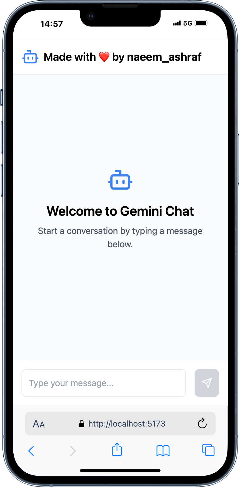

# 🚀 Gemini Chatbot - AI-Powered Chat Application

Welcome to **Gemini Chatbot**! This project is a chatbot powered by Google's **Gemini AI**, built with **React and TypeScript**. It allows users to interact with an AI assistant and receive responses in real-time.

---

## 📸 Preview

<div align="center">
  
  
</div>

---

## 📌 Features
✅ AI-powered chatbot using Google's Gemini API  
✅ Real-time message handling  
✅ Responsive and modern UI  
✅ Error handling for failed API calls  
✅ Smooth user experience with loading indicators  

---

## 🛠 Installation & Setup

### **1️⃣ Clone the Repository**
```sh
git clone https://github.com/your-repo/gemini-chatbot.git
cd gemini-chatbot
```

### **2️⃣ Install Dependencies**
```sh
npm install  # or yarn install
```

### **3️⃣ Set Up API Keys**
You need a valid **Gemini API Key** from Google. Create a `.env.local` file in the root directory and add:
```sh
NEXT_PUBLIC_GEMINI_API_KEY=your_api_key_here
```

Make sure to replace `your_api_key_here` with your actual API key.

### **4️⃣ Run the Development Server**
```sh
npm run dev  # or yarn dev
```
The app should now be running at: **http://localhost:3000** 🚀

---

## 🔑 API Reference
This project uses **Google Gemini AI API**. Here’s how the API is structured:
- **Endpoint**: `https://generativelanguage.googleapis.com/v1beta/models/gemini-pro:generateContent`
- **Headers**:
  ```json
  {
    "Content-Type": "application/json"
  }
  ```
- **Request Body**:
  ```json
  {
    "contents": [
      {
        "role": "user",
        "parts": [{ "text": "Hello!" }]
      }
    ],
    "generationConfig": {
      "temperature": 0.7,
      "maxOutputTokens": 2048
    }
  }
  ```

---

## 📝 Project Structure
```
📦 gemini-chatbot
 ┣ 📂 src
 ┃ ┣ 📂 components
 ┃ ┃ ┣ 📜 ChatInput.tsx
 ┃ ┃ ┣ 📜 ChatMessage.tsx
 ┃ ┃ ┗ 📜 Header.tsx
 ┃ ┣ 📂 types
 ┃ ┃ ┗ 📜 index.ts
 ┃ ┣ 📜 App.tsx
 ┃ ┗ 📜 index.tsx
 ┣ 📜 .env.local.example
 ┣ 📜 package.json
 ┗ 📜 README.md
```

---

## 🛡 Security Notice
⚠ **DO NOT** expose your API keys publicly. Always use environment variables.

If you accidentally commit your API key, **revoke it immediately** and generate a new one.

---

## 👨‍💻 Contributors & Ownership
- **Owner**: [NP5555](https://github.com/NP5555)  
- Contributions are welcome! Feel free to open issues or submit pull requests.

---

## 📜 License
This project is licensed under the **MIT License**.

---

🔗 **Follow for Updates**: [GitHub](https://github.com/NP5555) | [LinkedIn](https://www.linkedin.com/in/naeem-ashraf-242663190)  
🎯 **Star this repo** if you like the project! ⭐

